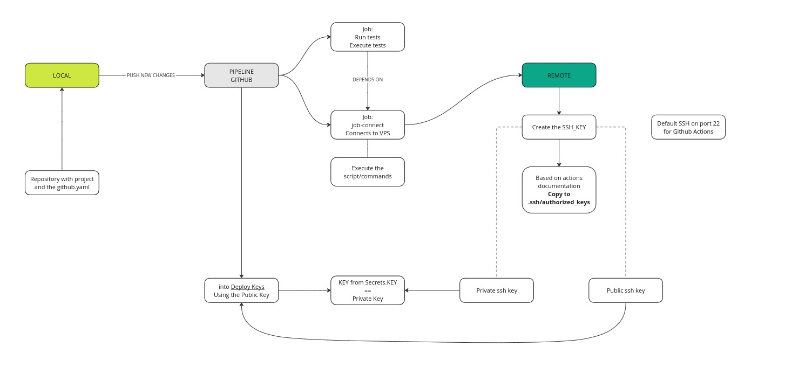

# Winc-Assignment-CD

[](https://github.com/Rhomekso/Winc-Assignment-CD/actions/workflows/testing.yml)


# README.md

## Overview

This README provides solutions to common issues encountered when using GitHub Actions with a Flask application hosted on a VPS from Digital Ocean. It includes troubleshooting steps for SSH connection errors, service management on the VPS, and the correct setup for deploying updates via GitHub Actions.

## Issues and Solutions

### GitHub Actions

#### Issue:

```plaintext
ssh: handshake failed: ssh: overflow reading version string
```


**Description:**
This error was encountered when GitHub Actions attempted to connect to the VPS.

**Solution:**
The problem was due to GitHub Actions trying to connect to the default server rather than the specific VPS server where the Flask application is running. The correct approach is to configure GitHub Actions to connect to the VPS server only when necessary, avoiding redundant connections that could lead to errors.

### Digital Ocean VPS

In the VPS, a Flask application was set up to ensure that something was running when executing the following commands:
- `systemctl restart flask-site`:
  - Restarts the Flask application service.
- `systemctl status flask-site`:
  - Displays the status of the Flask application service.

**Problem:**
Initially, changes made to the application were not visible because the localhost was used for testing.

**Solution:**
The issue was resolved by switching from localhost to the VPS server, allowing changes to be reflected correctly in the application. This adjustment ensured that updates were visible and the application functioned as expected.

### SSH Setup

#### Issue:
Misunderstanding the setup and purpose of using SSH.

**Solution:**
After some assistance, the correct setup involved using GitHub secrets and Deploy Keys. This setup ensures secure connections to the VPS, preventing unauthorized access. By using secrets and Deploy Keys, a secure and automated deployment process was established.

## Deployment Setup

A flowchart was created to illustrate the entire setup process, including:
- The interaction between GitHub Actions and the VPS.
- The use of Deploy Keys and secrets to secure the connection.

This flowchart helps in understanding the workflow.




## Conclusion

By addressing these issues and applying the provided solutions, a reliable and secure deployment process was established for the Flask application hosted on a Digital Ocean VPS. The use of systemctl commands ensures proper management of the application service, while the secure SSH setup via GitHub secrets and Deploy Keys protects the VPS from unauthorized access.

For detailed setup instructions and further troubleshooting, refer to the flowchart and the steps outlined in this README.
